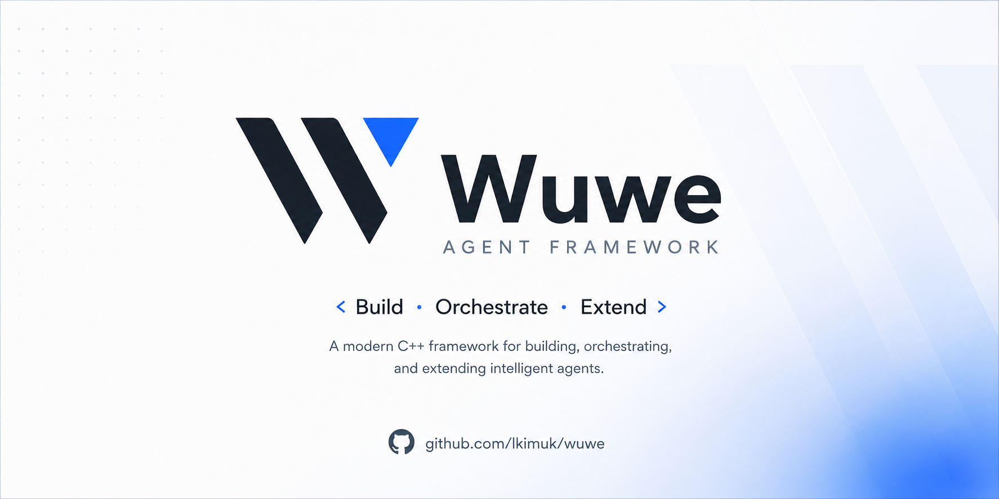

# Wuwe

Wuwe is a C++20 framework for building tool-using, stateful, and auditable AI agents in native applications, services, and command-line programs.

It provides independently usable modules for model access, typed tools, reasoning, reflection, planning, orchestration, memory, retrieval-augmented generation, MCP, networking, policy, approvals, audit, observability, and controlled execution.

## Release support

Version 0.1.0 is verified on:

| Platform | Package | Status |
| --- | --- | --- |
| Windows x64 / Visual Studio 2022 | `wuwe-0.1.0-windows-x64.zip` | Certified release profile |
| Ubuntu 24.04 Linux x64 | `wuwe-0.1.0-linux-x64.tar.gz` | Certified release profile |

The codebase is kept portable, but macOS is not part of the 0.1.0 certification matrix. The default `controlled_process` backend is cross-platform; the opt-in `restricted_process` backend is available only on Windows in this release.

## Capabilities

| Area | Included capabilities |
| --- | --- |
| Models and tools | OpenAI-compatible, Anthropic, Gemini, and Ollama clients; streaming; typed schemas and dispatch |
| Agent runtime | Tool loops, callbacks, cancellation, typed orchestration, reasoning modes, reflection, plans, and traces |
| State and knowledge | Scoped memory, file and SQLite persistence, embeddings, retrieval, reranking, grounding, and citations |
| MCP | Server, client, subprocess host, gateway, stdio, HTTP, access policy, audit, and telemetry |
| Operations and governance | Capability decisions, host approvals, audit events, common observability sinks, and module telemetry |
| Controlled execution | Policy-bound Python subprocesses, approvals, resource limits, backend contracts, and audit events |
| Networking | Common HTTP API with cpr/libcurl and cpp-httplib backends |

The complete module map and release boundaries are in the [documentation overview](docs/intro.md).

## Build

Requirements:

- CMake 3.25 or newer for the included presets
- Git
- a C++20 compiler
- vcpkg referenced through `VCPKG_ROOT`

Windows:

```powershell
$env:VCPKG_ROOT = "D:\tools\vcpkg"

cmake --preset windows-vcpkg
cmake --build --preset windows-vcpkg-release
ctest --preset windows-vcpkg-release
```

Linux:

```bash
export VCPKG_ROOT="$HOME/vcpkg"

cmake --preset linux-vcpkg
cmake --build --preset linux-vcpkg-release
ctest --preset linux-vcpkg-release
```

The official Windows profile uses Schannel and SQLite. The Linux profile uses OpenSSL and SQLite. Dependencies are restored from the pinned vcpkg manifest into the build tree.

See [Getting started](docs/getting-started.md) and [Dependencies](docs/dependencies.md).

## Minimal client

```cpp
#include <iostream>
#include <wuwe/wuwe.h>

int main() {
  wuwe::llm_config config {
    .model = "gpt-4.1-mini",
  };

  auto client = wuwe::make_llm_client("OpenAI", config);
  const auto response = client->complete("Explain RAII in one paragraph.");

  if (!response) {
    std::cerr << response.error_code.message() << '\n';
    return 1;
  }

  std::cout << response.content << '\n';
}
```

Set `OPENAI_API_KEY` before running the program. Other built-in providers use the same `llm_client` interface.

## Consume an installed SDK

```cmake
cmake_minimum_required(VERSION 3.20)
project(my_agent LANGUAGES CXX)

set(CMAKE_CXX_STANDARD 20)
set(CMAKE_CXX_STANDARD_REQUIRED ON)

find_package(wuwe CONFIG REQUIRED)

add_executable(my_agent main.cpp)
target_link_libraries(my_agent PRIVATE wuwe::wuwe)
```

Add the Wuwe installation prefix to `CMAKE_PREFIX_PATH` when needed. The exported package requests the public dependencies enabled in that build.

## Package

After building and testing:

```powershell
.\tools\package-wuwe.ps1 -BuildDir build-vcpkg -Configuration Release
```

```bash
bash ./tools/package-wuwe.sh --build-dir build-linux-vcpkg --configuration Release
```

Each archive contains the static SDK, CMake package files, examples, docs, `manifest.json`, checksums, Apache Tika, and a platform-matched Temurin 21 JRE. SQLite and OpenSSL remain public link dependencies when enabled.

See [Packaging](docs/packaging.md).

## Production boundaries

- `controlled_process` is a bounded subprocess backend, not a strong sandbox.
- SQLite is intended for local persistence. The SQLite knowledge index uses a C++ linear scan, not ANN search.
- Qdrant and other remote indexes are external services managed by the host.
- The host owns identity, secrets, user consent, approvals, retention, and deployment policy.
- Inspect package metadata and backend enforcement contracts instead of inferring capabilities.

## Documentation

- [Documentation website](https://lkimuk.github.io/Wuwe/)
- [Overview](docs/intro.md)
- [LLM providers](docs/llm-providers.md)
- [Orchestration](docs/orchestration.md)
- [Reasoning](docs/reasoning.md)
- [Planning](docs/planning.md)
- [Memory](docs/memory-management.md)
- [Knowledge and RAG](docs/knowledge-retrieval.md)
- [Model Context Protocol](docs/mcp.md)
- [Security and governance](docs/security-governance.md)
- [Observability](docs/observability.md)
- [Controlled execution](docs/execution-runtime.md)

Build the website with Node.js 20 or newer:

```bash
cd website
npm ci
npm run build
```

## License

Wuwe is distributed under the terms in [LICENSE](LICENSE).
