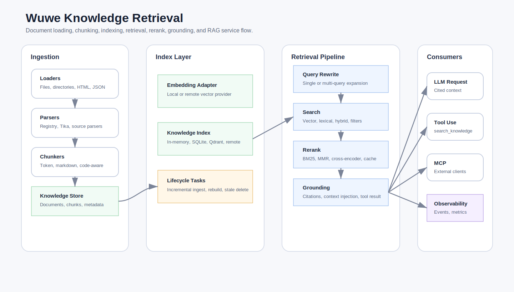

# Knowledge Retrieval

Use `<wuwe/agent/knowledge/knowledge.hpp>` as the module entry header when you
want the full RAG / Knowledge Retrieval surface. Individual headers remain
available for smaller compile units.

Async task state and progress contracts live in `knowledge_task.hpp`.
Knowledge events can also be bridged into the shared
`wuwe::agent::observability::event_sink` through `agent_knowledge_event_sink`.



`wuwe::agent::knowledge` provides a standalone retrieval layer for external
documents. It is organized around a local production workflow:

1. Load files or directories into `knowledge_document` values.
2. Split documents into cited `knowledge_chunk` values.
3. Persist documents and chunks in a `knowledge_store`.
4. Build or rebuild a retrieval index from stored chunks.
5. Retrieve relevant chunks with vector and lexical scoring.
6. Inject cited chunks into an `llm_request`, or expose search as a tool.

## Current Implementation Status

The Knowledge Retrieval module is currently at a framework-complete stage for
local and service-integrated RAG workflows. The implemented surface includes:

- Document ingestion for Markdown, text, local HTML, HTTP/HTTPS HTML pages, RTF,
  CSV, JSON, OpenAPI JSON, and source repositories.
- Optional Apache Tika HTTP parsing for PDF, DOCX, PPTX, XLSX, and legacy Office
  formats.
- Parser plugin registration through `knowledge_parser_registry`.
- Character, token, Markdown-aware, paragraph-aware, code-fence-safe, and
  code-symbol-aware chunking.
- In-memory, JSONL file, SQLite, Qdrant, and remote-vector adapter indexes.
- Remote-vector adapter classes for pgvector, OpenSearch, and Milvus gateways.
- Vector, lexical, hybrid, metadata-filtered, and ACL-filtered retrieval.
- Query rewrite and multi-query retrieval, including an HTTP LLM rewrite adapter.
- BM25, MMR, callback cross-encoder, HTTP cross-encoder, and cached reranking.
- Retrieval and rerank caches with LRU eviction and optional TTL expiry.
- Citation-oriented context injection and `search_knowledge` tool exposure.
- Incremental ingest, stale deletion, rebuild diagnostics, async ingest/rebuild,
  cancellation, retry/backoff, and partial-failure reporting.
- Trace events, in-memory observability, Prometheus scrape output, and
  OpenTelemetry-style span capture.
- Golden-query evaluation, grounding/citation checks, and benchmark utilities.
- JSON-driven pipeline construction with `build_knowledge_pipeline_from_json()`.

The local verification targets currently pass:

```powershell
cmake --build --preset windows-vcpkg-debug --target knowledge_tests knowledge_retrieval_example knowledge_benchmark_example
.\build-vcpkg\tests\Debug\knowledge_tests.exe
.\build-vcpkg\examples\Debug\knowledge_retrieval_example.exe
.\build-vcpkg\examples\Debug\knowledge_benchmark_example.exe --docs 40 --queries 8 --concurrency 2 --json
```

`url_rag_example` is the smallest live URL RAG smoke test: it hardcodes the C++
Core Guidelines URL, ingests the page, retrieves relevant cited context, and
asks an OpenAI-compatible LLM to answer from that context. It requires
`OPENROUTER_API_KEY` or `OPENAI_API_KEY`.

Optional live integrations are skipped unless configured:

- `WUWE_TIKA_URL` enables the Tika live parser test.
- `WUWE_QDRANT_URL` enables the Qdrant live vector-index test.
- `WUWE_QDRANT_KNOWLEDGE_COLLECTION` overrides the Qdrant live-test collection.

Remaining work is mainly deployment- and data-specific. Production data
migration helpers and real-corpus benchmarking entry points now exist; larger
remaining items are native pgvector, OpenSearch, and Milvus clients beyond the
HTTP adapter, a real Prometheus HTTP endpoint or OTLP exporter,
OCR/multimodal parsing, and broader real-corpus benchmark suites.

## Testing The RAG Flow

Start with the offline tests. These do not require Tika, Qdrant, or an LLM
provider:

```powershell
.\build\tests\Debug\knowledge_tests.exe
.\build\tests\Debug\memory_tests.exe
```

For a live PDF retrieval smoke test, run Qdrant and Tika, then configure the
environment:

```powershell
$env:WUWE_QDRANT_URL="http://localhost:6333"
$env:WUWE_TIKA_URL="http://127.0.0.1:9998"
$env:OPENROUTER_API_KEY=[Environment]::GetEnvironmentVariable("OPENROUTER_API_KEY", "User")
```

Run retrieval without answer generation first:

```powershell
$pdf = ([Uri]'file:///C:/Users/ligx/Downloads/Agentic%20Design%20Patterns%20A%20Hands-On%20Guide%20to%20Building%20Intelligent%20Systems%20(Antonio%20Gull%C3%AD).pdf').LocalPath

.\build\examples\Debug\knowledge_qdrant_rag_example.exe `
  --docs $pdf `
  --query "What are the main agentic design patterns described in this PDF?" `
  --collection wuwe_pdf_test `
  --limit 4 `
  --candidate-limit 32 `
  --no-answer `
  --clear
```

Expected signs of a healthy run:

```text
docs=1 ingested=1 errors=0
retrieved=4
Context block:
[1] ... document_summary ...
```

For the complete RAG path, enable query rewrite, LLM document summary, and answer
generation:

```powershell
.\build\examples\Debug\knowledge_qdrant_rag_example.exe `
  --docs $pdf `
  --query "List the main agentic design patterns in this PDF." `
  --collection wuwe_pdf_test `
  --limit 4 `
  --candidate-limit 32 `
  --query-rewrite `
  --llm-summary `
  --answer
```

On a repeated run with the same unchanged PDF, `skipped=1` is expected because
incremental ingest detects the existing content hash. The output should include
`rewritten_queries`, `Generated answer`, and `LLM usage`.

For local benchmark smoke tests, create a plain query file. The benchmark query
file format is one query per line, with an optional tab-separated limit:

```powershell
@"
RAG retrieval citations	5
agentic design patterns	5
tenant access control	5
"@ | Set-Content .\rag-queries.txt

.\build\examples\Debug\knowledge_benchmark_example.exe `
  --corpus docs `
  --query-file .\rag-queries.txt `
  --json
```

## Minimal Local Pipeline

```cpp
namespace knowledge = wuwe::agent::knowledge;

auto retriever = std::make_shared<knowledge::knowledge_retriever>(
  std::make_shared<knowledge::file_knowledge_store>("knowledge.jsonl"),
  std::make_shared<knowledge::in_memory_knowledge_index>(),
  embedding_model);

knowledge::directory_knowledge_loader loader;
const auto result = retriever->ingest_incremental(loader.load("docs"), true);
retriever->rebuild_index();
```

`ingest_incremental()` compares `content_hash` metadata and skips unchanged
documents. When `erase_stale` is true, documents no longer present in the loaded
set are removed from the store and index.

## Upload And Ask API

`knowledge_rag_service` wraps the common application workflow: load one file or
directory, ingest it incrementally, then answer questions with cited context.
It is intended for product surfaces such as "upload a PDF and ask about it"
without making each caller rebuild the orchestration code:

```cpp
namespace knowledge = wuwe::agent::knowledge;

auto retriever = std::make_shared<knowledge::knowledge_retriever>(
  std::make_shared<knowledge::file_knowledge_store>("knowledge.jsonl"),
  std::make_shared<knowledge::in_memory_knowledge_index>(),
  embedding_model,
  knowledge::knowledge_splitter({
    .max_tokens = 600,
    .overlap_tokens = 80,
    .include_document_summary_chunk = true,
  }));

std::vector<std::shared_ptr<knowledge::knowledge_document_enricher>> enrichers {
  std::make_shared<knowledge::llm_knowledge_document_enricher>(
    llm_client,
    knowledge::llm_knowledge_document_enricher_config {
      .model = "openrouter/auto",
    }),
};

knowledge::knowledge_rag_service rag(
  retriever,
  knowledge::knowledge_document_loader::make_default("http://127.0.0.1:9998"),
  llm_client);

auto upload = rag.upload_document("handbook.pdf", {
  .metadata = { { "collection", "handbook" } },
  .enrichers = std::move(enrichers),
}, true);

auto web_upload = rag.upload_document("https://example.com/guide.html", {
  .metadata = { { "collection", "web" } },
});

auto answer = rag.ask({
  .query = "What are the main design patterns?",
  .model = "openrouter/auto",
  .policy = {
    .max_results = 5,
    .candidate_results = 24,
    .surrounding_chunks_before = 1,
    .surrounding_chunks_after = 1,
  },
});
```

`knowledge_upload_report` returns document counts, ingest counts, load time,
ingest time, total time, and named stages. `knowledge_answer_report` returns the
context block, citation results, retrieval trace, optional LLM answer, and
retrieve/context/answer timing.

Document enrichers are optional. `llm_knowledge_document_enricher` writes a
retrieval-oriented summary into `metadata["summary"]`; when document summary
chunks are enabled, that LLM summary is indexed together with the heuristic
overview and extracted TOC lines.

## Context Injection

```cpp
knowledge::knowledge_context context(retriever);
request = context.augment(std::move(request), user_query);
```

The default context block includes source URI, section, and line metadata when
available:

```text
Relevant knowledge:
[1] docs/guide.md | Retrieval | lines 12-18
...
```

Before injection, results are post-processed by `knowledge_result_processor`.
The default policy removes duplicate chunks and merges adjacent chunks from the
same source when they fit within the configured merged-size budget. This keeps
the prompt smaller and avoids repeated citations for neighboring slices.

## Tool Search

```cpp
auto provider = std::make_shared<knowledge::knowledge_tool_provider>(*retriever);
wuwe::llm_agent_runner runner(client, provider);
```

The provider exposes `search_knowledge`, which returns JSON results containing
chunk content, score, score breakdown, source URI, line range, and metadata.
It accepts a `topic` shortcut plus a general `filters` object for exact metadata
filters such as `{ "collection": "docs", "audience": "internal" }`.

## Retrieval Quality Controls

`knowledge_query` supports hybrid scoring controls:

- `vector_weight`
- `lexical_weight`
- `minimum_score`
- `candidate_limit`

The in-memory index combines vector similarity with lexical token overlap. This
keeps local retrieval useful even with simple embedding models and allows callers
to require a minimum relevance score.

Each `knowledge_result` carries the final weighted `score` plus the raw
`vector_score` and `lexical_score`. Tool search returns the same fields in JSON
so applications can log score breakdowns, tune weights, and build retrieval
quality tests without changing the retrieval path.

When a reranker is configured, set `candidate_limit` higher than `limit` to fetch
more first-stage candidates before final reranking.

Attach a `knowledge_query_rewriter` to enable query rewrite or multi-query
retrieval. The retriever searches the original query plus unique rewritten
queries, merges duplicate chunks by best score, then applies access filtering and
reranking. `http_knowledge_query_rewriter` provides a ready HTTP JSON adapter for
LLM query rewrite services; it posts `{ "query": "...", "max_rewrites": N }` and
expects either a JSON array of strings or `{ "rewrites": [...] }`.

## Retrieval Trace

Use `knowledge_retriever::retrieve_detailed()` when callers need structured
diagnostics:

```cpp
auto report = retriever->retrieve_detailed({
  .text = "RAG retrieval",
  .limit = 3,
  .candidate_limit = 12,
});
```

The report includes final results plus a trace id and metrics containing
first-stage candidate count, post-access-filter count, final count, reranker
usage, embedding latency, index latency, rerank latency, and total latency.

## Observability

Attach a `knowledge_event_sink` to receive structured lifecycle events for
ingest, retrieval, and index rebuild operations:

```cpp
auto sink = std::make_shared<knowledge::in_memory_knowledge_event_sink>();
retriever->set_event_sink(sink);
auto report = retriever->retrieve_detailed({ .text = "RAG retrieval" });
```

Events include a `trace_id`, event name, timestamp, and string attributes such
as document id, candidate counts, final result count, operation latency, and
error messages. Start, complete, failed, and async rebuild cancellation events
are emitted where applicable. The retrieve completion event shares the same
trace id returned by `retrieve_detailed()`, so applications can correlate
user-visible answers with retrieval logs.

`prometheus_knowledge_event_sink` exports counters and sums in Prometheus text
format. `otel_knowledge_event_sink` records OpenTelemetry-style spans with trace
ids and attributes for adapters that forward events to an OTLP exporter.

## Pipeline Builder

`knowledge_pipeline` provides presets for common deployments:

```cpp
auto pipeline = knowledge::knowledge_pipeline::make()
  .local()
  .with_embedding_model(embedding_model)
  .with_splitter(knowledge::knowledge_splitter({
    .max_tokens = 600,
    .overlap_tokens = 80,
  }))
  .build();

pipeline.retriever().ingest(document);
auto context_block = pipeline.context().build_context_block("RAG retrieval");
```

Use `.file_backed(store_path, index_path)`, `.sqlite_index(store_path,
index_path)`, or `.qdrant_index(store_path, config)` to select persistent
backends.

## Reranking

`bm25_knowledge_reranker` provides BM25-style lexical reranking with document
length normalization and score fusion. Use it when first-stage vector or hybrid
search should gather candidates broadly, then promote exact lexical matches.

`mmr_knowledge_reranker` applies maximal marginal relevance to trade off
relevance against diversity, reducing near-duplicate chunks in the final context.

`cross_encoder_knowledge_reranker` accepts a `cross_encoder_knowledge_scorer`.
Use `callback_cross_encoder_knowledge_scorer` to connect an external
cross-encoder, reranking service, or LLM-based scorer without coupling the core
retriever to a specific model provider. `http_cross_encoder_knowledge_scorer`
provides a ready HTTP JSON scorer for remote rerank services; it posts the query,
candidate chunk, and current retrieval scores, then expects either a numeric JSON
value or an object containing `score`.

## Access Control

`knowledge_access_scope` standardizes tenant, user, and role filtering. Chunks
may include these metadata keys:

- `tenant_id`
- `user_id`
- `allowed_users` as a comma-separated list
- `allowed_roles` as a comma-separated list

`knowledge_query::access`, `knowledge_policy::access`, and `search_knowledge`
tool arguments all use this model. Chunks without ACL metadata remain public.

## Chunking Quality

`knowledge_splitter` supports Markdown heading sections, overlap, and paragraph
boundary preference. The paragraph preference tries to split at blank lines or
line breaks near the target chunk size before falling back to a hard character
limit.

Set `chunking_policy::max_tokens` to switch from character windows to simple
token windows. `overlap_tokens` controls token overlap. This is useful when an
embedding provider has token limits and callers need predictable chunk budgets.

Markdown fenced code blocks are protected by default through
`protect_markdown_code_fences`, so technical documentation is less likely to
inject partial code snippets.

For source files, `respect_code_symbols` splits common code extensions around
class, struct, namespace, function, and method-like definitions before falling
back to size-based chunking. Code chunks are marked with
`metadata["chunking"] = "code_symbol"`.

For broad questions such as "what does this PDF cover?", enable
`chunking_policy::include_document_summary_chunk`. The splitter prepends a
small document-level chunk containing title/source metadata, an overview from
the beginning of the document, and likely section or pattern lines. This gives
the retriever an indexable overview without changing the original document
chunks. The chunk is marked with `metadata["chunking"] = "document_summary"`.

If `metadata["summary"]` exists, the summary chunk includes it under `LLM
summary`. The splitter also extracts TOC-like pattern lines such as `Prompt
Chaining Pattern Overview` or `Knowledge Retrieval (RAG) Pattern Overview` into
an `Extracted pattern table of contents` block. This improves questions that ask
for a whole-document list rather than a narrow passage.

The same extracted entries are stored on the document summary chunk as
`metadata["toc_entries"]`, encoded as a JSON array of strings. Tool callers and
evals can read this metadata directly instead of scraping the summary text.

## Context Expansion

`knowledge_policy::surrounding_chunks_before` and
`surrounding_chunks_after` expand retrieved chunks with neighboring chunks from
the same document before result processing and prompt injection. This provides a
lightweight parent/child retrieval pattern: retrieve precise small chunks, then
inject nearby context for readability.

## Evaluation

`knowledge_eval.hpp` provides `evaluate_knowledge_retrieval()` for golden-query
regression tests. It reports total cases, hits, recall@k, MRR, and per-case
returned document IDs.

Use `load_knowledge_eval_cases()` to keep regression cases in JSON:

```json
[
  {
    "name": "patterns",
    "query": "main agentic design patterns",
    "expected_document_ids": ["agentic-patterns"],
    "expected_terms": ["Prompt Chaining", "Tool Use"],
    "limit": 3
  }
]
```

`expected_document_ids` drives hit and MRR metrics. `expected_terms` checks that
the returned chunks contain important phrases, which is useful for broad-query
RAG regressions where the right document is not enough. Export results with
`knowledge_eval_result_to_json()` for CI logs.

## Production Migration

`knowledge_migration.hpp` provides lightweight production maintenance helpers:

- `audit_knowledge_store()` counts documents, chunks, orphan chunks, empty
  content, embedding dimension mismatches, and index schema mismatches.
- `migrate_knowledge_store()` copies source documents into a target retriever,
  optionally clears the target first, erases stale target documents, and returns
  source/target audit reports plus per-document ingest results.

Use these helpers when moving from one store or index backend to another, or
when validating a file-backed knowledge store before rebuilding a derived index:

```cpp
auto report = knowledge::migrate_knowledge_store(
  source_store,
  target_store,
  target_retriever,
  { .clear_target = true },
  {
    .expected_embedding_dimension = 1536,
    .expected_index_schema_version = 1,
  });
```

## Grounding Checks

`knowledge_grounding_checker` validates generated answers against retrieved
results. It extracts `[1]`-style citations, rejects out-of-range citation
numbers, and can require every sentence to include a citation:

```cpp
knowledge::knowledge_grounding_checker checker({
  .require_sentence_citations = true,
});
auto report = checker.check(answer, retrieved_results);
```

## Index Lifecycle

`knowledge_retriever::rebuild_index()` remains the simple rebuild API.
`rebuild_index_detailed()` rebuilds chunk by chunk and reports scanned, rebuilt,
skipped, and per-chunk errors so production callers can diagnose embedding or
index failures without losing the whole operation.

`knowledge_indexing_policy` records embedding provider, model, version,
embedding dimension, and index schema version into chunk metadata during ingest
and rebuild. Set `expected_embedding_dimension` to reject accidental mixed
embedding dimensions.

`ingest_batch()` ingests multiple documents and returns per-document errors
instead of failing the whole batch on the first bad document.

Long-running operations also have future-based async variants:

```cpp
auto task = retriever->ingest_batch_async(documents,
  [](const knowledge::knowledge_task_progress& progress) {
    // progress.state, progress.completed, progress.total, progress.errors
  });

auto result = task->get();
```

`rebuild_index_detailed_async()` follows the same task/progress model. These APIs
move work off the caller thread and expose polling through `task->progress()`.
Call `task->request_cancel()` to stop before the next document or chunk begins.
Pass `knowledge_task_policy` to enable simple retry/backoff for transient
embedding or index failures.

## Loaders

`file_knowledge_loader` reads local text files and includes lightweight HTML and
RTF text extraction fallbacks for `.html`, `.htm`, and `.rtf` files.
`directory_knowledge_loader` includes Markdown, text, HTML, RTF, CSV, and JSON
extensions by default.

`structured_knowledge_loader` adds low-dependency structured ingestion:

- `load_csv()` converts header-based CSV rows into readable row documents.
- `load_json()` flattens JSON into `path: value` lines.
- `load_openapi_json()` summarizes OpenAPI JSON operations by method, path,
  summary, operation id, and tags.

`code_knowledge_loader` loads source repositories, skips common generated or
vendor directories such as `.git`, `build`, `node_modules`, `target`, and
`vendor`, and records `relative_path` plus inferred `language` metadata.

## Tika Document Parsing

`tika_knowledge_loader` is an optional HTTP parser backend for richer document
formats such as PDF, DOCX, PPTX, XLSX, and legacy Office files. It does not make
Tika a required dependency of the core library; callers run Tika Server
separately and configure the loader with its base URL:

```cpp
knowledge::tika_knowledge_loader loader({
  .base_url = "http://localhost:9998",
});

auto document = loader.load("handbook.pdf");
retriever->ingest(std::move(document));
```

The loader sends raw file bytes to `PUT /tika` with `Accept: text/plain`, then
stores the returned text in `knowledge_document::content`. Metadata records the
source extension, inferred content type, `parser = "tika"`, `extracted_as =
"text"`, and `content_hash`.

For PDFs, the loader also attempts a second best-effort `Accept: text/html`
request and extracts Tika HTML page blocks when available. Multi-page HTML is
joined with form-feed separators, which allows the splitter to record
`page_start` and `page_end` metadata and allows context citations to include
page ranges. If Tika does not return page-shaped HTML, the loader falls back to
the normal text response. Set `tika_knowledge_loader_config::extract_pdf_pages =
false` to disable the extra request.

Run Tika Server out of process, for example:

```bash
java -jar tika-server-standard.jar
```

For applications that need parser plugins, use `knowledge_parser_registry`.
Register `file_knowledge_document_parser` for built-in text-like formats and
`tika_knowledge_document_parser` for Tika-backed formats, then call
`registry.parse(path)`.

## Remote Vector Backends

`remote_vector_knowledge_index` defines a small HTTP JSON adapter protocol for
vector backends hosted behind an application gateway. Convenience classes
`pgvector_knowledge_index`, `opensearch_knowledge_index`, and
`milvus_knowledge_index` set the provider label while sharing the same
`knowledge_index` interface:

```cpp
auto index = std::make_shared<knowledge::pgvector_knowledge_index>(
  knowledge::remote_vector_knowledge_index_config {
    .base_url = "https://vector-gateway.internal",
    .namespace_name = "product_docs",
  });
```

The adapter sends `/vectors/upsert`, `/vectors/search`, `/vectors/delete`, and
`/vectors/clear` requests with serialized chunks and embeddings. Deployments can
map that protocol to pgvector, OpenSearch, Milvus, or another managed vector
service.

Native database clients are intentionally deferred. The HTTP adapter keeps the
core library free of database-specific client dependencies, connection-pool
configuration, authentication plugins, and version compatibility issues. Add a
native pgvector, OpenSearch, or Milvus client only when an application needs
direct database connectivity rather than a gateway.

OCR and multimodal parsing are also out of scope for the current core path. Tika
covers text-bearing PDF and Office documents well; scanned PDFs, images, tables,
and layout-aware extraction need heavier dependencies and domain-specific
quality checks. Those should be added as optional parser plugins when a product
actually needs scanned-document support.

## Benchmarking

`benchmark_knowledge_retrieval()` runs a list of queries against a retriever and
reports query count, total latency, average latency, p50, p95, p99, max latency,
and total returned results. It supports concurrent query workers and JSON output
through `knowledge_benchmark_report_to_json()`. Use it for local regression
checks before introducing larger external load tests. The
`knowledge_benchmark_example` executable generates a synthetic local corpus and
can be scaled with `WUWE_KNOWLEDGE_BENCH_DOCS`,
`WUWE_KNOWLEDGE_BENCH_QUERIES`, `WUWE_KNOWLEDGE_BENCH_CONCURRENCY`, and
`WUWE_KNOWLEDGE_BENCH_JSON`.

For real-corpus smoke tests, pass a directory and a query file:

```powershell
.\build-vcpkg\examples\Debug\knowledge_benchmark_example.exe `
  --corpus docs `
  --query-file queries.txt `
  --concurrency 4 `
  --json
```

The query file uses one query per line. Add an optional tab-separated limit when
a query should use a different result count:

```text
RAG retrieval citations	5
tenant security policy	8
```

## Caching

Attach `in_memory_knowledge_retrieval_cache` with
`knowledge_retriever::set_retrieval_cache()` to cache final retrieval results by
query parameters, filters, access scope, and scoring weights. Ingest, erase,
clear, rebuild, reranker changes, and query rewriter changes invalidate the
cache. The in-memory cache supports LRU eviction and optional TTL expiry.

Wrap any reranker with `cached_knowledge_reranker` to cache expensive rerank
results, including remote cross-encoder or LLM rerank calls. The wrapper also
supports LRU and TTL controls.

## Config Driven Pipelines

`build_knowledge_pipeline_from_json()` builds a retrieval pipeline from JSON
configuration while the application supplies its embedding model:

```cpp
auto pipeline = knowledge::build_knowledge_pipeline_from_json({
  { "backend", "local" },
  { "chunking", { { "max_chars", 800 }, { "overlap_chars", 80 } } },
  { "cache", { { "enabled", true }, { "max_entries", 1024 }, { "ttl_ms", 60000 } } },
  { "reranker", { { "type", "bm25" } } },
}, embedding_model);
```

Supported backend values are `local`, `file`, `sqlite`, `qdrant`, `pgvector`,
`opensearch`, and `milvus`. Configurable sections include `chunking`, `context`,
`cache`, `reranker`, `qdrant`, `remote_vector`, and `query_rewrite`.

## Current Backends

- `in_memory_knowledge_store`
- `file_knowledge_store`
- `in_memory_knowledge_index`
- `file_knowledge_index`
- `sqlite_knowledge_index` when `WUWE_ENABLE_SQLITE` is available
- `qdrant_knowledge_index`
- `pgvector_knowledge_index`, `opensearch_knowledge_index`, and
  `milvus_knowledge_index` through the remote vector adapter protocol

The file store persists documents and chunks. File and SQLite indexes persist
chunk embeddings, so they can retrieve immediately after process restart without
rebuild.

`qdrant_knowledge_index` provides a remote vector index backend:

```cpp
auto index = std::make_shared<knowledge::qdrant_knowledge_index>(
  knowledge::qdrant_knowledge_index_config {
    .base_url = "http://localhost:6333",
    .collection_name = "wuwe_knowledge",
    .embedding_provider = "openai-compatible",
    .embedding_model = "text-embedding-3-small",
    .embedding_version = "2026-05-05",
  });
```

The Qdrant payload stores chunk identity, document identity, source URI, line
range, metadata, embedding metadata, and the serialized chunk. Query metadata
filters and `tenant_id` are pushed into Qdrant filters; full ACL semantics are
also checked after payload restore.

Set `WUWE_QDRANT_URL` to run the optional live integration test. Set
`WUWE_QDRANT_KNOWLEDGE_COLLECTION` to override the test collection name.

## Qdrant RAG Example

`knowledge_qdrant_rag_example` demonstrates the end-to-end service-backed RAG
path: load documents, optionally parse office/PDF files with Tika, embed chunks
with an OpenAI-compatible embedding API, upsert/search Qdrant, build a cited
context block, and expose the same query through `search_knowledge`.

Configure the services:

```powershell
$env:WUWE_QDRANT_URL="http://localhost:6333"
$env:WUWE_TIKA_URL="http://127.0.0.1:9998"
$env:OPENROUTER_API_KEY="<api-key>"
$env:OPENROUTER_BASE_URL="https://openrouter.ai/api"
$env:OPENROUTER_EMBEDDING_MODEL="openai/text-embedding-3-small"
$env:OPENROUTER_CHAT_MODEL="openrouter/auto"
```

The example also accepts `OPENAI_API_KEY`, `OPENAI_BASE_URL`, and
`OPENAI_EMBEDDING_MODEL` for other OpenAI-compatible embedding providers.

Run it against a document directory:

```powershell
.\build-vcpkg\examples\Debug\knowledge_qdrant_rag_example.exe `
  --docs docs `
  --query "How should RAG answers cite retrieved material?" `
  --collection wuwe_knowledge_rag_demo `
  --candidate-limit 24 `
  --clear
```

The example uses a temporary file-backed authoritative store and Qdrant as the
derived vector index. Use `--clear` when changing embedding dimensions or when
you want to rebuild the demo collection from scratch.

By default the example retrieves a broader candidate set, reranks it with MMR
for diversity, enables a document summary chunk for broad questions, then calls
the configured chat model and prints a final cited answer. Pass `--query-rewrite`
to generate additional retrieval queries with the configured chat model,
`--llm-summary` to enrich uploaded documents with an LLM-generated summary
before chunking, `--no-answer` to stop after retrieval/context/tool output,
`--candidate-limit <N>` to tune first-stage recall, or `--chat-model <model>` to
override `OPENROUTER_CHAT_MODEL`.
