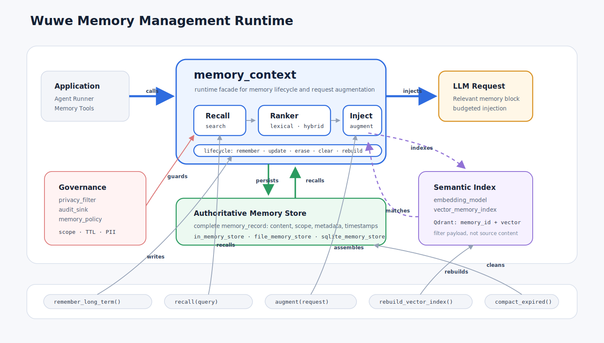

# Memory Management

Use `<wuwe/agent/memory/memory.hpp>` as the module entry header when you want
the full Memory Management surface. Individual headers remain available for
smaller compile units.

Lifecycle and audit result types live in `memory_lifecycle.hpp`; `memory_context`
keeps the runtime API and delegates those shared contracts to the smaller
header.

本文档说明 Wuwe Agent Framework 当前的 Memory Management 能力、API 边界和生产使用方式。部署细节见 [memory-deployment.md](memory-deployment.md)。

## 架构图



## 1. 概览

Memory Management 在框架层提供统一的记忆记录、检索、排序、压缩、注入和治理能力。它的核心目标是：在调用 LLM 前，根据当前请求和应用策略，组装出可控、可审计、可扩展的上下文。

当前实现已经覆盖：

- 短期记忆：conversation、working、summary。
- 长期记忆：long_term、retrieved。
- 可替换存储：in-memory、file-backed、可选 SQLite。
- 可替换排序：lexical ranker、hybrid ranker。
- 可选向量检索：in-memory vector index、Qdrant vector index。
- OpenAI-compatible embedding model。
- 生命周期 API：list、get、update、erase、clear、rebuild、reconcile、compact。
- 治理能力：audit sink、privacy filter、retention TTL。
- runner 集成和 memory tools。

框架不会在应用不可见的情况下写入长期记忆。长期写入必须由应用 API 或显式 tool call 触发。

## 2. 职责边界

Memory Management 由几类对象协作完成，每类对象只负责自己的边界：

| 组件 | 职责 |
| --- | --- |
| `memory_record` | 记忆数据模型，包含内容、scope、kind、visibility、metadata、过期时间等字段。 |
| `memory_store` | 权威事实存储，负责 memory record 的增删改查和基础过滤。 |
| `memory_context` | 高层门面，协调 store、ranker、embedding、vector index、治理 hook 和请求注入。 |
| `memory_ranker` | 对候选记录排序和裁剪，不负责持久化。 |
| `embedding_model` | 把文本转换成向量。 |
| `vector_memory_index` | 保存向量索引和用于过滤的 payload，不作为唯一事实源。 |
| `memory_tool_provider` | 暴露受控的 `save_memory` / `search_memory` tool。 |

推荐调用原则：

- 应用层优先通过 `memory_context` 操作记忆。
- 长期记忆的 `update`、`erase`、`clear` 不应直接绕过 `memory_context`，否则向量索引不会自动同步。
- Qdrant 可以持久化，但在本架构中属于可重建的派生索引；完整事实仍以 `memory_store` 为准。
- privacy、audit、retention 策略应在 `memory_context` 层集中配置。

## 3. 核心数据模型

### Memory Kind

```cpp
enum class memory_kind {
  conversation,
  working,
  summary,
  long_term,
  retrieved,
};
```

- `conversation`：用户、助手和 tool 相关消息。
- `working`：单次 agent run 内的临时状态。
- `summary`：对会话或任务片段的压缩摘要。
- `long_term`：需要跨会话保留的稳定信息。
- `retrieved`：外部检索系统返回并纳入上下文选择的记录。

### Memory Visibility

```cpp
enum class memory_visibility {
  visible,
  hidden,
};
```

- `visible`：允许注入模型请求。
- `hidden`：仅供应用、诊断、排序或审计使用，不直接注入 prompt。

`metadata["sensitivity"] == "secret"` 的记录也不会注入 prompt。

### Memory Scope

```cpp
struct memory_scope {
  std::string tenant_id;
  std::string user_id;
  std::string application_id;
  std::string conversation_id;
  std::string agent_id;
};
```

Scope 是隔离和审计的基础。生产长期记忆默认要求：

- `application_id` 非空。
- `tenant_id` 或 `user_id` 至少一个非空。

### Memory Record

```cpp
struct memory_record {
  std::string id;
  memory_kind kind { memory_kind::working };
  memory_visibility visibility { memory_visibility::visible };

  std::string content;
  std::string summary;
  memory_scope scope;

  double score { 0.0 };
  int priority { 0 };

  std::chrono::system_clock::time_point created_at {};
  std::chrono::system_clock::time_point updated_at {};
  std::optional<std::chrono::system_clock::time_point> expires_at;

  std::map<std::string, std::string> metadata;
};
```

常用 metadata key：

```text
source
sensitivity
retention
topic
tool_name
message_role
index_status
index_error
vector_score
```

### Memory Query

```cpp
struct memory_query {
  std::string text;
  memory_scope scope;
  std::vector<memory_kind> kinds;
  std::size_t limit { 8 };
  std::map<std::string, std::string> filters;
  bool include_expired { false };
};
```

查询规则：

- `kinds` 为空表示不按 kind 限制。
- `filters` 默认精确匹配 metadata。
- `include_expired=false` 时过期记录会被排除。
- 默认策略要求有可用 scope，否则 recall/list 返回空结果。

## 4. 存储

### Store Interface

```cpp
class memory_store {
public:
  virtual ~memory_store() = default;

  virtual memory_record add(memory_record record) = 0;
  virtual std::optional<memory_record> get(
    const std::string& id,
    const memory_scope& scope) const = 0;
  virtual std::vector<memory_record> search(const memory_query& query) const = 0;
  virtual bool update(memory_record record) = 0;
  virtual bool erase(const std::string& id, const memory_scope& scope) = 0;
  virtual std::size_t clear(const memory_scope& scope) = 0;
};
```

实现职责：

- 生成缺失的 `id`。
- 按 scope、kind、metadata、expiry 做基础过滤。
- 保留 metadata。
- 普通未命中不抛异常。
- 存储损坏、路径非法、数据库错误等不可恢复错误可以抛异常。

### 当前实现

| 实现 | 用途 | 说明 |
| --- | --- | --- |
| `in_memory_store` | 测试、示例、短生命周期 session | 单进程内加锁，不跨进程持久化。 |
| `file_memory_store` | 本地工具、小规模持久化 | JSON Lines 格式；`add()` 追加，`update/erase/clear` 重写文件。 |
| `sqlite_memory_store` | 本地单进程持久化 | 可选构建；适合小到中等规模数据，不等同于服务端数据库。 |

SQLite 开关：

- `WUWE_SQLITE_MODE=on` 时 SQLite3 是必需依赖，找不到则配置失败；官方发行 preset 使用该模式。
- `WUWE_SQLITE_MODE=auto` 时找到开发库就定义 `WUWE_HAS_SQLITE=1`，否则构建不带 SQLite 能力。
- `WUWE_SQLITE_MODE=off` 时明确禁用 SQLite，并定义 `WUWE_HAS_SQLITE=0`。
- 未启用时包含 `sqlite_memory_store` 头文件仍可编译，但运行时调用会抛出清晰错误。
- 旧的 `WUWE_ENABLE_SQLITE` 仅用于兼容已有构建目录，新配置应使用 `WUWE_SQLITE_MODE`。

0.1.0 的 SQLite Memory 查询先在 SQL 中约束 scope，再在 C++ 中完成部分 kind、
expiry、metadata 过滤和词法排序。它是可靠的本地持久化基线，但当前不承诺 FTS5、
WAL 调优、schema migration 或多进程高并发写入。完整依赖和能力边界见
[Dependencies](dependencies.md)。

## 5. 排序与召回

### Lexical Ranker

默认 ranker 是 `lexical_memory_ranker`。它综合：

- query 与 content/summary 的词法匹配。
- `priority`。
- `updated_at`。
- store 或 vector index 提供的 `score`。

### Hybrid Ranker

语义召回推荐使用 `hybrid_memory_ranker`：

```cpp
memory.set_ranker(std::make_shared<wuwe::agent::memory::hybrid_memory_ranker>(
  wuwe::agent::memory::hybrid_memory_ranker_policy {
    .vector_weight = 0.65,
    .lexical_weight = 0.20,
    .priority_weight = 0.10,
    .recency_weight = 0.05,
    .minimum_vector_score = 0.25,
  }));
```

`memory_context` 从 vector index 收到候选后，会把相似度写入：

- `record.score`
- `record.metadata["vector_score"]`

`hybrid_memory_ranker` 使用 `vector_score`、词法分、priority 和 recency 计算最终排序。

## 6. 向量检索

向量检索由两个抽象组成：

```cpp
class embedding_model {
public:
  virtual ~embedding_model() = default;
  virtual std::vector<float> embed(std::string_view text) const = 0;
  virtual std::vector<std::vector<float>> embed_batch(
    const std::vector<std::string>& texts) const;
};

class vector_memory_index {
public:
  virtual ~vector_memory_index() = default;
  virtual void upsert(
    const memory_record& record,
    const std::vector<float>& embedding) = 0;
  virtual void upsert_batch(
    const std::vector<memory_record>& records,
    const std::vector<std::vector<float>>& embeddings);
  virtual std::vector<vector_memory_match> search(
    const vector_memory_query& query) const = 0;
  virtual bool erase(const std::string& memory_id, const memory_scope& scope) = 0;
  virtual std::size_t clear(const memory_scope& scope) = 0;
};
```

当前实现：

- `in_memory_vector_index`：测试和本地小规模语义验证。
- `qdrant_memory_index`：通过 HTTP REST 访问 Qdrant。
- `openai_embedding_model`：调用 OpenAI-compatible `/v1/embeddings`。

### Qdrant 边界

Qdrant 是可选运行时服务依赖，不是编译期依赖。推荐架构：

```text
memory_store
  保存完整 memory_record，是权威事实源

vector_memory_index
  保存 memory_id、embedding vector 和过滤 payload

memory_context
  写入、更新、删除、重建时同步维护 store/index 一致性
```

`Authoritative Memory Store` 和 `Semantic Index / Qdrant` 都可能持久化，但它们的职责不同：

| 组件 | 保存内容 | 调用时机 | 失败后的恢复方式 |
| --- | --- | --- | --- |
| `memory_store` | 完整 `memory_record`：content、summary、scope、metadata、TTL、timestamps。 | 写入长期记忆、读取完整记录、list/get、update、erase、clear、compact。 | 这是权威事实源，丢失后无法由 Qdrant 完整恢复。 |
| `vector_memory_index` / Qdrant | `memory_id`、embedding vector、scope/kind/filter payload。 | 长期记忆写入后的索引同步、语义 recall、rebuild、reconcile。 | 这是派生索引，可由 `memory_store` 重新生成。 |

因此，Qdrant 即使开启了磁盘持久化，也不承担“完整记忆数据库”的职责。它回答的问题是“哪些记忆在语义上可能相关”；`memory_store` 回答的问题是“这条记忆的完整事实是什么”。

示例：用户要求记住一条 API 偏好：

```text
The user prefers explicit ownership in public APIs.
```

`memory_store` 保存完整事实：

```text
id: mem-42
kind: long_term
content: The user prefers explicit ownership in public APIs.
scope:
  user_id: local-user
  application_id: wuwe-example
metadata:
  topic: api-style
  source: user
created_at: ...
updated_at: ...
expires_at: ...
```

Qdrant 保存用于语义检索的派生索引：

```text
point_id: <stable id derived from mem-42 and scope>
vector: [0.013, -0.082, ...]
payload:
  memory_id: mem-42
  user_id: local-user
  application_id: wuwe-example
  kind: long_term
  visibility: visible
  metadata:
    topic: api-style
  embedding_model: text-embedding-3-small
  index_schema_version: 1
```

调用关系：

```text
remember_long_term()
  -> memory_store.add完整记录
  -> embedding_model.embed(content)
  -> vector_memory_index.upsert(memory_id + vector + payload)

recall("How should we design this API?")
  -> embedding_model.embed(query)
  -> vector_memory_index.search(query vector) 返回 mem-42
  -> memory_store.get(mem-42, scope) 读取完整记录
  -> ranker 排序
  -> augment() 注入 LLM request

rebuild_vector_index()
  -> memory_store.search(long_term records)
  -> embedding_model.embed_batch(contents)
  -> vector_memory_index.upsert_batch(...)
```

Qdrant payload 包含：

```text
memory_id
tenant_id
user_id
application_id
conversation_id
agent_id
kind
visibility
priority
created_at
updated_at
expires_at
metadata
embedding_provider
embedding_model
embedding_version
embedding_dimension
index_schema_version
```

如果 Qdrant collection 丢失或需要迁移，只要 authoritative store 仍在，就可以重新生成 embedding 并重建索引。

### 召回流程

1. `query.text` 通过 `embedding_model` 生成 query vector。
2. `vector_memory_index` 按 vector、scope、kind、metadata filters 返回 `memory_id` 候选。
3. `memory_context` 从长期 store 读取完整 record。
4. 再次应用 kind、metadata、expiry、hidden/secret 过滤。
5. 合并词法候选，交给 ranker 排序和裁剪。

## 7. Memory Context API

`memory_context` 是应用最常使用的高层 API。

### 写入

```cpp
memory_record remember(memory_record record);
memory_record remember_working(std::string content, std::map<std::string, std::string> metadata = {});
memory_record remember_summary(std::string content, std::map<std::string, std::string> metadata = {});
memory_record remember_long_term(
  std::string content,
  memory_scope scope,
  std::map<std::string, std::string> metadata = {});
```

长期写入会校验生产可用 scope，并在配置了 embedding/index 时同步写入向量索引。

### 查询与审计

```cpp
std::optional<memory_record> get(
  const std::string& id,
  const memory_scope& scope,
  memory_kind kind = memory_kind::long_term) const;

std::vector<memory_record> list(memory_query query = {}) const;
std::vector<memory_record> recall(const memory_query& query) const;
```

- `list()` 面向应用审计和管理。
- `recall()` 面向上下文组装，会合并 vector、short-term 和 long-term 候选。

### 生命周期

```cpp
bool update(memory_record record);
bool erase(
  const std::string& id,
  const memory_scope& scope,
  memory_kind kind = memory_kind::long_term);
std::size_t clear(const memory_scope& scope);

std::size_t rebuild_vector_index(memory_query query = {}) const;
memory_rebuild_result rebuild_vector_index_detailed(memory_query query = {}) const;
memory_rebuild_result reconcile_pending_reindex(memory_query query = {}) const;
memory_compaction_result compact_expired(memory_query query = {});
```

行为说明：

- `update()` 会同步维护向量索引。
- `erase()` 默认删除长期记忆；删除短期记录时应显式传入 kind。
- `clear()` 清理同一 scope 下的短期、长期和向量索引。
- `rebuild_vector_index_detailed()` 返回 scanned、rebuilt、skipped、errors。
- `reconcile_pending_reindex()` 只重建 `index_status=pending_reindex` 的记录。
- `compact_expired()` 删除已过期记录。

### 上下文注入

```cpp
llm_request augment(llm_request request, std::string_view query_text) const;
std::string build_memory_block(
  const std::string& query_text,
  const std::vector<chat_message>* request_messages = nullptr) const;
```

注入顺序：

1. summary
2. long_term
3. working
4. conversation

默认注入格式：

```text
Relevant memory:
- [summary] ...
- [long_term] ...
- [working] ...
- [conversation] ...
```

### 配置

```cpp
void set_policy(memory_policy policy);
void set_ranker(std::shared_ptr<memory_ranker> ranker);
void set_embedding_model(std::shared_ptr<embedding_model> model);
void set_vector_index(std::shared_ptr<vector_memory_index> index);
void set_audit_sink(std::function<void(const memory_audit_event&)> sink);
void set_privacy_filter(std::function<bool(memory_record&, std::string&)> filter);
void set_scope(memory_scope scope);
```

## 8. 策略

`memory_policy` 控制预算、TTL、安全要求和注入方式。

```cpp
struct memory_policy {
  std::size_t max_recent_messages { 12 };
  std::size_t max_working_records { 16 };
  std::size_t max_long_term_records { 8 };
  std::size_t max_summary_records { 2 };

  std::size_t max_memory_chars { 6000 };
  std::size_t max_memory_tokens { 1500 };
  std::size_t estimated_chars_per_token { 4 };
  std::size_t max_record_chars { 1200 };
  std::size_t vector_rebuild_batch_size { 32 };

  std::chrono::seconds default_working_ttl { 0 };
  std::chrono::seconds default_long_term_ttl { 0 };

  bool include_conversation { true };
  bool include_working { true };
  bool include_summaries { true };
  bool include_long_term { true };

  bool require_scoped_recall { true };
  bool require_scope_for_long_term { true };
  bool dedupe_request_messages { true };
  bool throw_on_vector_index_error { false };

  bool inject_as_system_message { true };
  std::string injection_header { "Relevant memory:" };
};
```

### 预算

当前实现使用字符预算，并提供轻量 token 估算：

```text
effective_budget = min(max_memory_chars, max_memory_tokens * estimated_chars_per_token)
```

每条记录优先使用 `summary`，否则使用 `content`。超过 `max_record_chars` 的 content 会被截断并追加 `...`。

### 向量索引错误

默认策略下，长期记忆写入成功但向量索引失败时：

- 记录仍保留在 authoritative store。
- metadata 标记 `index_status=pending_reindex`。
- metadata 写入 `index_error`。
- 后续可调用 `reconcile_pending_reindex()` 修复。

若 `throw_on_vector_index_error=true`，索引失败会抛出异常。

## 9. 隐私、审计与保留

### Privacy Filter

应用可以注册 privacy filter：

```cpp
memory.set_privacy_filter([](memory_record& record, std::string& reason) {
  if (record.metadata["sensitivity"] == "secret") {
    reason = "secret memory is not allowed";
    return false;
  }
  return true;
});
```

filter 可以：

- 修改 `record.metadata`。
- 调整 `visibility`。
- 设置或收紧 `expires_at`。
- 拒绝写入或更新。

拒绝时 `memory_context` 会发出 audit event，并抛出 `std::invalid_argument`。

### Audit Sink

```cpp
memory.set_audit_sink([](const memory_audit_event& event) {
  write_audit_log(event);
});
```

当前 audit action：

```text
remember
update
erase
clear
compact_expired
rebuild_index
reconcile_index
summarize_conversation
reject
```

Audit log 建议记录 action、success、scope、memory id、kind、reason/message 和时间。不要把完整敏感内容写入 audit log。

### Retention

每条记录可以设置 `expires_at`。策略也支持默认 TTL：

- `default_working_ttl`
- `default_long_term_ttl`

TTL 为 `0` 表示不自动设置默认过期时间。过期记录默认不参与检索；物理删除由 `compact_expired()` 完成。

## 10. Conversation 与 Runner 集成

### Conversation Observation

```cpp
void observe(const chat_message& message, const memory_scope& scope = {});
```

`observe()` 会把 message 记录为 `memory_kind::conversation`。空 content 且无 tool calls 的消息会跳过。

### Runner

`llm_agent_runner` 可以接收 `memory_context*`。启用后：

- user prompt 会作为 conversation memory 记录。
- request 会在发送前经过 `memory.augment()`。
- assistant response 会作为 conversation memory 记录。
- tool call 和 tool result 会作为 conversation memory 记录。
- 未传入 `memory_context` 时，runner 行为保持不变。

### Memory Tools

`memory_tool_provider` 暴露：

- `save_memory`
- `search_memory`

Tool-based 长期记忆写入是 opt-in。provider 内部持有 `memory_context`、scope、policy 和 review callback，不让模型直接填写这些私有控制字段。

## 11. Conversation Summarization

框架提供摘要编排，但不默认调用 LLM。应用必须传入 summarizer callback：

```cpp
auto result = memory.summarize_conversation(
  {
    .scope = memory.scope(),
    .max_source_records = 64,
    .erase_source_records = true,
    .metadata = { { "topic", "session-summary" } },
  },
  [](const std::vector<memory_record>& records) {
    return summarize_with_application_policy(records);
  });
```

该 API 会：

- 读取指定 scope 下的 conversation records。
- 按 `created_at` 升序传给 callback。
- 将 callback 返回文本保存为 summary memory。
- 写入 `source=conversation_summary` 和 `source_count=<N>`。
- 可选删除源 conversation records。

没有 source、callback 为空或 callback 返回空字符串时，不创建 summary。

## 12. 示例

### 基础长期记忆

```cpp
#include <wuwe/agent/memory/file_memory_store.hpp>
#include <wuwe/agent/memory/in_memory_store.hpp>
#include <wuwe/agent/memory/memory_context.hpp>

auto short_term = std::make_shared<wuwe::agent::memory::in_memory_store>();
auto long_term = std::make_shared<wuwe::agent::memory::file_memory_store>("memory.jsonl");

wuwe::agent::memory::memory_context memory(short_term, long_term);
memory.set_scope({
  .user_id = "local-user",
  .application_id = "wuwe-example",
  .conversation_id = "session-1",
  .agent_id = "assistant",
});

memory.remember_long_term(
  "The user prefers explicit ownership in public APIs.",
  memory.scope(),
  { { "topic", "api-style" }, { "source", "user" } });

auto request = memory.augment(std::move(request), "memory API design");
```

### Qdrant Vector Index

```cpp
auto embedding = std::make_shared<wuwe::agent::memory::openai_embedding_model>(
  wuwe::agent::memory::openai_embedding_model_config {
    .base_url = "https://api.openai.com",
    .api_key = api_key,
    .model = "text-embedding-3-small",
  });

auto index = std::make_shared<wuwe::agent::memory::qdrant_memory_index>(
  wuwe::agent::memory::qdrant_memory_index_config {
    .base_url = "http://localhost:6333",
    .collection_name = "wuwe_memory",
    .embedding_provider = "openai-compatible",
    .embedding_model = "text-embedding-3-small",
  });

memory.set_embedding_model(embedding);
memory.set_vector_index(index);
memory.set_ranker(std::make_shared<wuwe::agent::memory::hybrid_memory_ranker>());

auto rebuilt = memory.rebuild_vector_index_detailed();
```

### Memory Tools

```cpp
wuwe::agent::memory::memory_tool_options options;
options.review_callback = [](const wuwe::agent::memory::memory_record& record) {
  return record.metadata.find("sensitivity") == record.metadata.end() ||
         record.metadata.at("sensitivity") != "secret";
};

auto memory_tools =
  std::make_shared<wuwe::agent::memory::memory_tool_provider>(memory, options);

wuwe::llm_agent_runner runner(client, memory_tools, &memory);
```

## 13. 测试与验证

当前测试入口：

```sh
cmake --build build --config Debug --target memory_tests
ctest --test-dir build -C Debug --output-on-failure -R memory_tests
```

Windows vcpkg preset：

```sh
set VCPKG_ROOT=D:\tools\vcpkg
cmake --preset windows-vcpkg
cmake --build --preset windows-vcpkg-debug --target memory_tests
ctest --test-dir build-vcpkg -C Debug --output-on-failure -R memory_tests
```

`cmake --preset windows-vcpkg` 使用仓库中的 `vcpkg.json` 自动恢复固定版本的
SQLite 到构建目录，无需预先在系统中安装 SQLite 开发包。

Qdrant live test 是 opt-in：

```sh
$env:WUWE_QDRANT_URL="http://localhost:6333"
ctest --test-dir build-vcpkg -C Debug --output-on-failure -R memory_tests
```

测试覆盖：

- store add/get/search/update/erase/clear。
- scope 隔离和长期 scope 校验。
- hidden/secret 过滤。
- request 去重和预算控制。
- runner observation。
- file store reload。
- SQLite 可用/不可用路径。
- memory tools。
- embedding request/parse。
- vector recall、Qdrant payload、batch rebuild。
- pending reindex、reconcile、compact expired。
- audit sink、privacy filter、retention TTL。

## 14. 后续扩展

当前实现已经具备生产化基础。后续增强应保持 API 边界稳定，优先考虑：

- 管理 CLI 或 UI：列出、过滤、删除、导出记忆。
- SQLite FTS5：增强本地全文检索。
- 后台维护任务：定时 compact、reconcile、rebuild。
- 指标与 tracing：召回数量、注入大小、索引错误率、rebuild 耗时。
- 更多 embedding provider 示例：本地模型、Ollama、企业网关。

这些增强不应改变默认行为：未创建并传入 `memory_context` 时，runner 不启用 memory。
