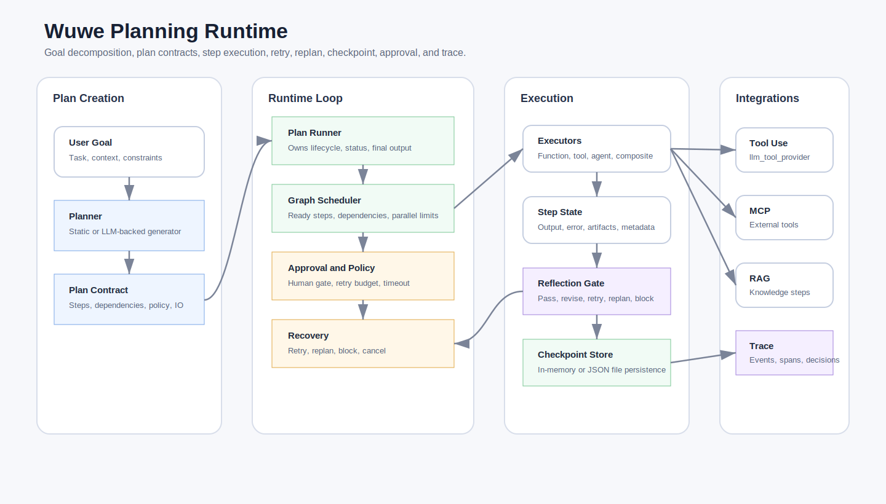

# Planning

Use `<wuwe/agent/planning/planning.hpp>` as the module entry header.



The Planning module adds a goal-driven control loop without changing existing
flow, runner, tool, memory, MCP, or RAG behavior. Applications opt in by
creating a `wuwe::agent::planning::plan_runner`.

## Layers

The public surface is intentionally grouped into four layers:

| Header | Layer | Responsibility |
| --- | --- | --- |
| `plan.hpp` | Plan contract | Data model, policy, `plan_validator`, `plan_normalizer`, and `plan_codec`. |
| `planner.hpp` | Plan creation | Static and LLM-backed planning. |
| `plan_executor.hpp` | Step execution | Function and tool-provider based step execution. |
| `plan_executor.hpp` | Agent handoff | `agent_plan_executor` and `composite_plan_executor` route steps to registered agents or tools. |
| `plan_reflection.hpp` | Reflection bridge | Optional step-result quality gate that maps Reflection actions back into Planning status. |
| `plan_runner.hpp` | Runtime loop | `plan_runner`, plus grouped runtime helpers for services, graph scheduling, step state, and recovery policy. |
| `plan_store.hpp` | Persistence | In-memory and JSON file stores for checkpointable plans. |

## Components

| Component | Responsibility |
| --- | --- |
| `plan` / `plan_step` | Data model for goal, steps, dependencies, assigned tool or agent, status, output, errors, and metadata. |
| `planner` | Interface for creating and revising plans. |
| `static_planner` | Deterministic planner backed by caller-provided steps. Useful for tests and fixed workflows. |
| `llm_planner` | LLM-backed planner that asks a model to return JSON plan steps. |
| `plan_executor` | Interface for executing one step. |
| `function_plan_executor` | Callback-based executor for application code. |
| `tool_plan_executor` | Executes steps through an existing Wuwe tool provider. |
| `agent_plan_executor` | Executes steps assigned to registered named agents. |
| `composite_plan_executor` | Dispatches agent steps to an agent executor and tool steps to a tool executor. |
| `plan_runner` | Control loop for selecting ready steps, executing them, retrying, replanning, observing, and returning final output. |
| `plan_reflection_gate` | Optional adapter from `reflection_runner` results into step pass, retry, replan, block, or revised output. |
| `plan_reflection_options` | Configures the Reflection runner, rubric, reflection scope, and custom request builder. |
| `plan_reflection_scope` | Decides whether completed, failed, or blocked steps should be reflected. |
| `plan_reflection_request_factory` | Builds the default or caller-provided `reflection_request` for a plan step. |
| `plan_reflection_metadata` | Owns reflection metadata keys, writes results to steps, and parses the stored action. |
| `plan_reflection_action_applier` | Applies Reflection actions back to `plan_step` status, output, and error. |
| `plan_step_recovery_policy` | Centralizes retry and replan decisions after execution and reflection. |
| `plan_policy` | Runner policy for retries, iteration limits, parallelism, timeouts, single-run step budget, replanning, resume behavior, and failure behavior. |
| `plan_observer` | Runner event callback for tracing or UI progress. |
| `plan_trace_sink` | Structured runtime trace callback with plan id, step id, iteration, and elapsed time. |
| `plan_store` | Persistence interface with `save`, `load`, `list`, and `erase`. |
| `plan_validator` | Validates plan structure, dependencies, tool/agent references, and tool input shape. |
| `plan_normalizer` | Repairs routine plan shape issues such as missing ids, duplicate ids, missing titles, and stale running steps. |
| `plan_codec` | Owns JSON extraction, plan serialization, and plan deserialization. |
| Plan contract helpers | `validate_plan()`, `normalize_plan()`, `plan_to_json()`, and `plan_from_json()` remain as thin convenience wrappers. |

## Basic Static Plan

```cpp
#include <wuwe/agent/planning/planning.hpp>

namespace planning = wuwe::agent::planning;

auto planner = std::make_shared<planning::static_planner>(
  std::vector<planning::plan_step> {
    {
      .id = "inspect",
      .title = "Inspect project",
    },
    {
      .id = "summarize",
      .title = "Summarize findings",
      .depends_on = { "inspect" },
    },
  });

auto executor = std::make_shared<planning::function_plan_executor>(
  [](const planning::plan_step& step, const planning::plan_execution_context&) {
    return planning::plan_step_result::completed("completed " + step.id);
  });

planning::plan_runner runner({
  .planner = planner,
  .executor = executor,
});

auto result = runner.run({ .goal = "Inspect and summarize the project" });
```

## Tool Execution

`tool_plan_executor` adapts any provider with the existing Wuwe shape:

```cpp
std::vector<wuwe::llm_tool> tools() const;
wuwe::llm_tool_result invoke(const std::string& name, const std::string& arguments_json) const;
```

A `plan_step` uses `assigned_tool` as the tool name and `input` as the JSON
argument payload.

## Tool-Aware LLM Planning

`planning_request::available_tools` gives `llm_planner` an explicit catalog of
tools. The planner prompt includes each tool name, description, and parameter
schema, and validation rejects plans that assign a tool outside the catalog.

```cpp
auto result = runner.run({
  .goal = "Look up relevant project facts",
  .available_tools = provider.tools(),
});
```

For tool steps, `input` must be a serialized JSON object, such as
`{"query":"memory policy"}`. Invalid JSON is rejected before the executor runs.

## Reflection Closed Loop

Planning can optionally run Reflection after a step produces a result. This is
off by default. When enabled, the runner sends the step result to a
`reflection_runner` before the step is observed as final.

```cpp
#include <wuwe/agent/planning/planning.hpp>
#include <wuwe/agent/reflection/reflection.hpp>

namespace planning = wuwe::agent::planning;
namespace reflection = wuwe::agent::reflection;

auto reflector = std::make_shared<reflection::llm_reflector>(client);
auto quality = std::make_shared<reflection::reflection_runner>(
  reflection::reflection_runner_options {
    .reflector = reflector,
  });

planning::plan_runner runner({
  .planner = planner,
  .executor = executor,
  .policy = {
    .max_step_attempts = 2,
    .allow_replanning = true,
  },
  .reflection = {
    .runner = quality,
    .rubric = {
      .criteria = {
        {
          .name = "correctness",
          .description = "The step result satisfies the plan goal and step instruction.",
          .weight = 1.0,
          .pass_threshold = 0.8,
        },
      },
      .pass_threshold = 0.8,
    },
  },
});
```

Action mapping:

- `pass`: keep the step completed and continue
- `revise`: replace `step.output` with `revised_output` when provided; otherwise mark the step failed
- `retry`: mark the step failed so retry policy can rerun it
- `replan`: mark the step failed and call `planner::revise_plan()` when replanning is allowed
- `block` / `escalate`: mark the step blocked and stop automatic progress unless the caller chooses to continue

The gate writes reflection metadata back onto the step:

```text
reflection_passed
reflection_score
reflection_action
reflection_issue_count
reflection_issue
```

`reflection_issue` is removed after a later successful reflection result, so
metadata does not keep a stale issue from an earlier failed attempt.

For advanced use, `plan_reflection_options::request_builder` can build the
exact `reflection_request` from the step, current plan, and observation. This
keeps the bridge thin: Reflection remains independent, and Planning only
consumes the final action.

Internal grouping:

```text
plan_runner
  -> plan_reflection_gate
       -> plan_reflection_scope
       -> plan_reflection_request_factory
       -> reflection_runner
       -> plan_reflection_metadata
       -> plan_reflection_action_applier
  -> plan_step_recovery_policy
```

The runner itself does not inspect raw `"reflection_action"` strings. It asks
`plan_step_recovery_policy`, which reads the typed action through
`plan_reflection_metadata`.

## Plan Validation

The runner validates plans after `create_plan()` and after `revise_plan()`.
Validation is enabled by default and can be configured through
`plan_runner_options::validation`.

Validation catches:

- empty goal or empty steps
- too many steps
- duplicate or missing step ids
- unknown dependencies
- dependency cycles
- unknown assigned tools or agents when catalogs are supplied
- non-object JSON input for tool steps

This is the boundary that keeps LLM planning from becoming an unchecked control
surface.

## Replanning

Set `plan_policy::allow_replanning` to let the runner call
`planner::revise_plan()` after a failed or blocked step. The planner receives a
`planning_observation` with the step status, output, error, and metadata.

Revised plans go through the same validation path before execution resumes.

## Checkpoint Resume

Use `plan_policy::max_steps_per_run` to run only part of a plan, serialize the
returned `plan`, and resume later.

```cpp
planning::plan_runner runner({
  .planner = planner,
  .executor = executor,
  .policy = { .max_steps_per_run = 1 },
});

auto paused = runner.run({ .goal = "Do a multi-step task" });
auto checkpoint = planning::plan_to_json(paused.value);

auto restored = planning::plan_from_json(checkpoint);
auto finished = runner.resume(restored);
```

Applications can persist checkpoints through `in_memory_plan_store` or
`file_plan_store`, or implement the `plan_store` interface.

If a checkpoint contains a `running` step, resume resets it to `pending` by
default. Configure `plan_policy::reset_running_steps_on_resume` if your
application wants different behavior.

## Approval Gates

Set `plan_step::requires_approval` to pause before executing that step. The
runner returns `plan_run_stop_reason::approval_required` and emits
`step_approval_required`. Set `plan_step::approved = true` and call
`resume()` to continue.

## Cancellation

`plan_runner_options::should_cancel` is checked before each step. When it
returns true, the runner stops with `plan_run_stop_reason::cancelled` and
returns the current plan state for checkpointing or inspection.

## Parallel Ready Steps

Set `plan_policy::max_parallel_steps` above 1 to execute independent ready
steps concurrently. Parallel execution is opt-in because tool providers and
application executors must be safe for concurrent calls.

## Timeouts

`plan_policy::step_timeout` marks slow steps as failed after execution returns
if their elapsed time exceeded the configured budget. `plan_policy::run_timeout`
stops the run before starting another step once the whole run has exceeded its
budget.

## Policy Hooks

`plan_runner_options::policy_check` can allow, deny, or require approval for a
ready step before execution. A denied step is marked blocked and consumes an
attempt.

## Typed I/O And Artifacts

Steps support both string `input` / `output` and JSON `input_json` /
`output_json`. `input_from_steps` injects upstream step outputs into downstream
`input_json`. Executors can return named JSON artifacts, stored on
`plan::artifacts` and passed to later steps through `plan_execution_context`.

## Agent Handoff

Use `agent_plan_executor` for steps with `assigned_agent`, or
`composite_plan_executor` to dispatch both tool and agent steps through one
executor.

## Serialization

Use `plan_to_json()` and `plan_from_json()` for checkpoints, trace payloads, and
UI state.

```cpp
auto checkpoint = wuwe::agent::planning::plan_to_json(result.value);
auto restored = wuwe::agent::planning::plan_from_json(checkpoint);
```

## Memory

`plan_runner_options::memory` is optional. When supplied, the runner records
plan creation and step completion as working memory through `memory_context`.

## Completion Status

The Planning module is complete as a framework-level Planning core. It owns the
in-process contract for plan creation, validation, execution, recovery,
governance hooks, and state handoff. It is intentionally not a full deployment
platform.

Current core coverage:

- plan data model, JSON codec, validation, and normalization
- static and LLM-backed planning
- tool-aware planning with tool catalog validation
- function, tool, agent, and composite executors
- dependency scheduling and opt-in parallel ready-step execution
- retry, replanning, cancellation, step budget, step timeout, and run timeout
- optional Reflection gate for retry, revise, replan, block, and escalation
- checkpoint serialization and `resume()`
- `in_memory_plan_store` and JSON `file_plan_store`
- approval gates and approval provider hook
- policy hook for allow, deny, or require approval
- typed JSON input/output and artifact passing
- observer events, trace sink, run metrics, and optional memory recording
- `step_reflected` event when a step result passes through the Reflection gate

Current observability is limited to callbacks and metadata. `plan_observer`
emits lifecycle events, `plan_trace_sink` receives structured trace events, and
Reflection-gated steps record `reflection_*` metadata. There is not yet a
built-in log exporter, redaction policy, correlation id system, or metrics
backend.

## Non-Goals

Planning core deliberately does not own these platform concerns:

- background worker processes
- distributed task queues
- distributed locks or leases
- external approval systems
- user/tenant identity providers
- database migrations
- hosted workflow UI
- OpenTelemetry or Prometheus exporters
- cost accounting across model providers

Those belong in platform adapters or neighboring modules. Keeping them out of
the core keeps the API small and lets applications choose their own deployment
model.

## Future Platform Work

These are the recommended follow-up layers if Wuwe needs a full workflow
platform around Planning:

1. **Durable Store Adapters**
   Add SQLite and server database implementations of `plan_store`. Include
   optimistic concurrency, updated-at timestamps, scoped listing, and compact
   checkpoint snapshots.

2. **Worker Runtime**
   Add a background runner that repeatedly loads resumable plans, claims them,
   runs a step budget, saves state, and releases the claim. This should live
   outside `plan_runner` so the core stays embeddable.

3. **Locking And Leases**
   Add lease records for distributed workers. A lease should have owner id,
   expiry, heartbeat, and steal/recover behavior for crashed workers.

4. **External Approval Adapter**
   Adapt `approval_provider` to real approval systems. Persist approver,
   reason, decision time, and policy source in step metadata.

5. **Structured Observability Export**
   Convert `plan_trace_sink` events to OpenTelemetry spans, Prometheus metrics,
   JSONL logs, or application-native traces. Keep exporters separate from core
   trace event generation.

6. **Cost And Token Accounting**
   Add optional usage aggregation from LLM planners and tool/agent executors.
   Track prompt tokens, completion tokens, tool latency, model name, and cost
   estimates by plan id and step id.

7. **Policy Module Integration**
   Replace ad hoc policy callbacks with a shared Guardrails/Policy module once
   that module exists. Planning should continue to consume the result as
   allow/deny/require-approval.

8. **UI And Operations API**
   Build a thin service/API layer for listing plans, inspecting steps, approving
   blocked steps, resuming checkpoints, and showing trace timelines.

9. **Artifact Store**
   Keep small JSON artifacts in `plan::artifacts`, but move large artifacts to
   a separate artifact store with references in plan metadata.

10. **Planner Quality Loop**
   Add evaluation datasets for LLM plans, repair quality, tool selection,
   dependency correctness, and replan behavior.

## Extension Guidelines

- Keep `plan_runner` embeddable and synchronous at the core layer.
- Add long-running services as adapters around `plan_runner::resume()`.
- Prefer implementing interfaces (`plan_store`, `approval_provider`,
  `policy_check`, `plan_trace_sink`) before adding new core concepts.
- Store large payloads outside the plan and keep checkpoint JSON inspectable.
- Keep tool and agent execution concurrency opt-in.
- Validate plans before execution and after every replan.
