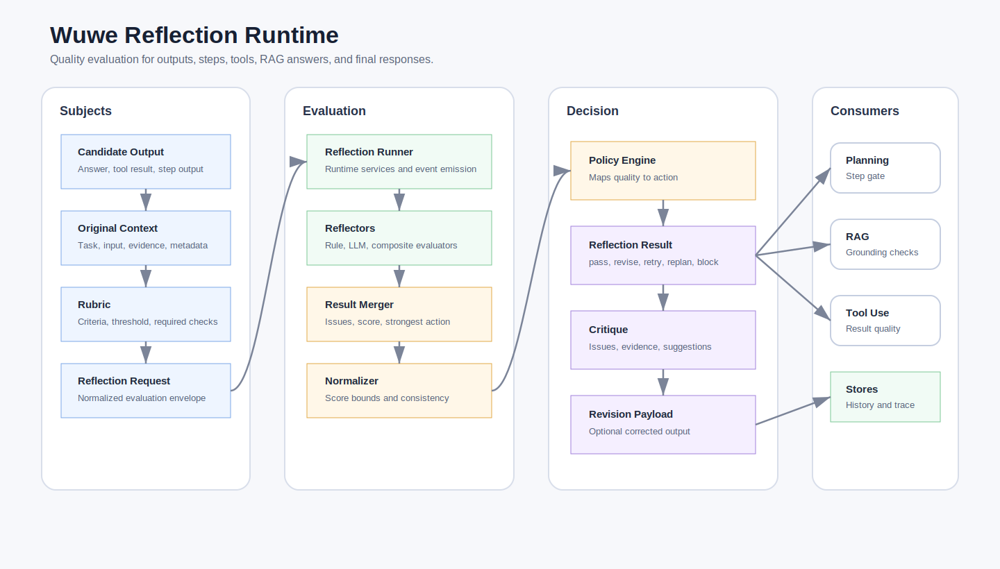

# Reflection

Use `<wuwe/agent/reflection/reflection.hpp>` as the module entry header.



The Reflection module is Wuwe's reusable quality-evaluation layer. It evaluates
an existing output, tool result, plan step result, RAG answer, or final answer
against a rubric and returns a structured critique plus an action recommendation.

Reflection is independent from Planning. Planning can consume Reflection
results, but Reflection can also be used by RAG, Tool Use, Memory, MCP, or
application-level final-answer checks.

The only built-in cross-module adapter today is Planning's optional
`plan_reflection_gate`. Other uses currently call `reflection_runner` directly.

## Layers

| Header | Layer | Responsibility |
| --- | --- | --- |
| `reflection_core.hpp` | Contract | Requests, rubrics, issues, results, policy, records, and JSON codec. |
| `reflector.hpp` | Evaluation | `reflection_rule_set`, `rule_reflector`, `llm_reflector`, and `composite_reflector`. |
| `reflection_runner.hpp` | Runtime | Runs reflectors, applies policy, emits events, and stores records through runtime services. |
| `reflection_store.hpp` | Persistence | In-memory and JSON file stores for reflection history. |
| `reflection.hpp` | Umbrella | Includes the full Reflection module. |

## Components

| Component | Responsibility |
| --- | --- |
| `reflection_request` | Input being evaluated: task, original input, candidate output, context, subject type, metadata, and rubric. |
| `reflection_rubric` | Quality criteria and pass threshold. |
| `reflection_result` | Structured result: pass/fail, score, recommended action, issues, revised output, and metadata. |
| `reflection_issue` | One critique item with severity, code, message, evidence, and suggestion. |
| `reflection_policy` | Maps score and issue severity to pass, revise, retry, replan, block, or escalate. |
| `reflection_policy_engine` | Applies `reflection_policy` to results while preserving the strongest action. |
| `reflection_result_normalizer` | Clamps scores and reconciles issue/action/revision consistency. |
| `reflection_result_merger` | Merges multiple reflector results into one score, issue list, and strongest action. |
| `reflector` | Interface for evaluating a request. |
| `reflection_rule_set` | Reusable deterministic rule evaluator and rule-based score/action mapper. |
| `rule_reflector` | Deterministic checks such as empty output, JSON object shape, required text, and forbidden text. |
| `llm_reflector` | LLM-backed rubric evaluation with structured JSON output. |
| `composite_reflector` | Runs multiple reflectors and merges their issues and strongest action. |
| `reflection_runner` | Orchestrates reflection, policy action mapping, observer events, and optional storage. |
| `reflection_runtime_services` | Internal grouping for observer, store, and record-id concerns. |
| `reflection_store` | Reflection record persistence interface. |
| `reflection_codec` | JSON parsing and serialization helpers. |

## Basic Use

```cpp
#include <wuwe/agent/reflection/reflection.hpp>

namespace reflection = wuwe::agent::reflection;

auto reflector = std::make_shared<reflection::rule_reflector>(
  reflection::rule_reflector_options {
    .reject_empty_output = true,
    .required_substrings = { "citation" },
  });

reflection::reflection_runner runner({
  .reflector = reflector,
});

auto result = runner.run({
  .task = "Check whether the answer includes citations",
  .candidate_output = "The answer text...",
  .subject_type = "final_answer",
});
```

The low-friction path is still just `reflector + reflection_runner`. Advanced
callers can use `reflection_rule_set`, `reflection_policy_engine`,
`reflection_result_normalizer`, and `reflection_result_merger` directly when
they need custom orchestration.

## Real LLM Example

`examples/src/reflection_example.cpp` runs `llm_reflector` against OpenRouter.
It reads `OPENROUTER_API_KEY` and optionally `OPENROUTER_CHAT_MODEL`.

```powershell
$env:OPENROUTER_API_KEY = "your_api_key"
$env:OPENROUTER_CHAT_MODEL = "openai/gpt-oss-120b:free"

cmake --build build-mcp --config Debug --target reflection_example
.\build-mcp\examples\Debug\reflection_example.exe
```

The example evaluates an intentionally wrong answer about Planning vs
Reflection and prints model, pass status, score, action, issues, evidence,
suggestions, and revised output when the model provides one.

## Actions

Reflection recommends one of:

- `pass`: output is acceptable
- `revise`: use `revised_output` or ask the generator to revise
- `retry`: rerun the producing step
- `replan`: ask Planning to revise the plan
- `block`: stop automatic execution
- `escalate`: require human or higher-level review

## How Reflection Decides

Reflection turns a candidate output into an action through a small, explicit
pipeline:

```text
candidate output
  -> reflector evaluates quality
  -> reflection_result_normalizer fixes result consistency
  -> reflection_policy_engine maps score/issues to action
  -> caller consumes pass/revise/retry/replan/block/escalate
```

The output is always structured as `reflection_result`:

```text
passed
score
recommended_action
issues[]
revised_output
metadata
```

### Rule-Based Decisions

`rule_reflector` uses `reflection_rule_set` for deterministic checks. Current
rules can check:

- empty output
- minimum output length
- valid JSON object shape
- required substrings
- forbidden substrings

Each failed rule produces a `reflection_issue` with severity, code, message,
and suggestion.

Default rule action mapping:

```text
warning  -> revise
error    -> retry
critical -> escalate
```

The rule score starts at `1.0` and is reduced by issue severity. Critical issues
therefore produce a low score and a strong action.

### LLM/Rubric Decisions

`llm_reflector` sends the task, original input, candidate output, context, and
rubric to the model. The model must return JSON with:

```json
{
  "passed": false,
  "score": 0.62,
  "recommended_action": "revise",
  "issues": [
    {
      "severity": "warning",
      "code": "thin_answer",
      "message": "Answer lacks detail",
      "evidence": "Only one sentence was provided",
      "suggestion": "Add supporting explanation",
      "metadata": {}
    }
  ],
  "revised_output": "Improved output when available",
  "metadata": {}
}
```

`reflection_result_normalizer` then clamps score to `0.0..1.0`, marks results
with issues as not passed, and respects rubric policy such as
`allow_revision = false`.

### Policy Decisions

`reflection_policy_engine` is the final action mapper. It preserves the
strongest action recommended by the reflector, but can strengthen it based on
score and issue severity.

Default policy behavior:

```text
passed && score >= pass_threshold && no issues -> pass
critical issue + escalate_on_critical          -> escalate
error issue + block_on_error                   -> block
explicit replan action                         -> replan
score >= revise_threshold + revised_output     -> revise
score >= retry_threshold                       -> retry
otherwise                                      -> block
```

This keeps action interpretation centralized so callers do not each invent
their own score mapping.

### Composite Decisions

`composite_reflector` runs multiple reflectors and uses
`reflection_result_merger` to combine them:

- pass only if all reflectors pass
- score is the lowest score
- issues are concatenated
- recommended action is the strongest action
- first non-empty `revised_output` is retained

This allows patterns like:

```text
rule_reflector + llm_reflector
  -> deterministic checks first
  -> rubric-based critique second
  -> one merged reflection_result
```

## Rubrics

Product-grade Reflection should use rubrics instead of vague prompts. A rubric
can describe criteria such as correctness, groundedness, citation quality,
security, or instruction following.

```cpp
reflection::reflection_rubric rubric {
  .criteria = {
    {
      .name = "groundedness",
      .description = "Claims are supported by provided context.",
      .weight = 0.5,
      .pass_threshold = 0.8,
    },
  },
  .pass_threshold = 0.75,
};
```

## Relationship To Planning

Planning looks forward and chooses actions. Reflection looks backward and
evaluates results. The Planning module now includes an optional
`plan_reflection_gate`, configured through `plan_runner_options::reflection`,
that uses Reflection as a step-result quality gate:

```text
step completed
  -> reflection_runner.run(step output)
  -> pass: continue
  -> retry: reset step pending
  -> revise: replace output with revised output
  -> replan: planner.revise_plan(...)
  -> block/escalate: mark step blocked
```

The gate converts `reflection_result::recommended_action` into normal Planning
control flow:

- `pass` leaves the step completed
- `revise` updates the step output when `revised_output` is available
- `retry` marks the step failed so `plan_policy::max_step_attempts` can rerun it
- `replan` marks the step failed and lets `planner::revise_plan()` rebuild the path
- `block` and `escalate` mark the step blocked

The adapter remains thin. Reflection does not depend on Planning; Planning only
consumes Reflection's structured action.

## Current Scope

Reflection is complete as a reusable evaluation core:

- structured request/result/issue/action contract
- rubric support
- deterministic rule reflector
- LLM-backed reflector
- composite reflector
- policy action mapping
- runner events
- in-memory and file stores
- JSON codec
- real LLM example through OpenRouter
- Planning step-result adapter through `plan_reflection_gate`

Current observability is intentionally simple:

- `reflection_observer` emits `reflection_started` and `reflection_completed`
- `reflection_record` can be stored through `reflection_store`
- Planning writes reflection action metadata to steps when the adapter is used

There is no built-in OpenTelemetry, Prometheus, JSONL, token/cost accounting,
or redaction layer in Reflection yet.

## Future Platform Work

Recommended follow-up layers:

1. RAG grounding adapter using retrieved citations and source coverage.
2. Code review adapter with correctness, security, style, and test criteria.
3. Memory review adapter for deciding whether proposed memories should be saved.
4. Reflection evaluation datasets and calibration metrics.
5. OpenTelemetry/Prometheus/JSONL exporters for reflection scores and actions.
6. Cost/token tracking for LLM reflection calls.
7. Persistent reflection stores backed by SQLite or server databases.
8. Redaction and audit policy for persisted reflection payloads.
